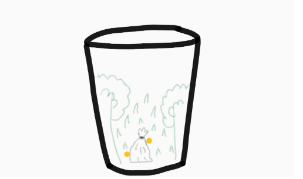
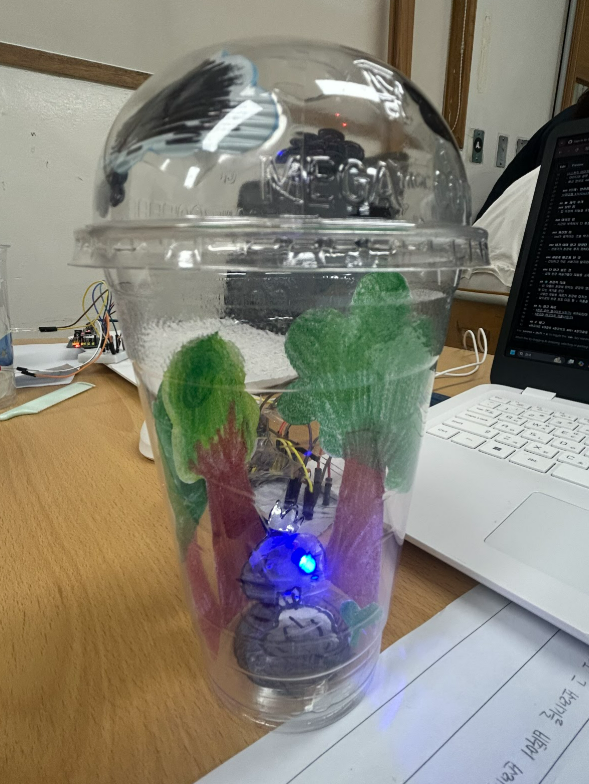

# 🌱 에코아트 프로젝트: [숲을 삼킨 쓰레기]

## 📖 프로젝트 개요
- **제작자**: 20616 이다솔
- **제작일**: 2025년 7월 16일
- **소개**
> 아름다운 자연 환경을 지키지 않고 마구잡이로 일회용품을 사용하고 생각없이 버리는 현대 사람들의 모습을 보고 이를 비판하기 위해 만들었다
## 📦 사용 재료
- 아두이노, 온도센서, LED, 브레드보드
- 카페 테이크아웃 컵, 종이,색연필,테이프,송곳,가위,네임펜, 말랑카우 쓰레기 

## 🔧 제작 과정

### 1단계: 아이디어 스케치

- 아이디어 설명 컵 속에 나무를 포함한 숲속을 만들고 가운데 쓰레기봉투를 놓은 후 쓰레기 하나가 숲을 망칠 수 있다는 의미를 담았다
- 예상 완성도 60%

### 2단계: 완성품

## 💭 제작 후기
### 잘된 점
- 컵 뚜껑에 하늘을 표현하고 컴 속에 종이를 오리고 붙여서 숲을 표현한 부분이 잘한 것 같다

### 아쉬운 점
- 시간이 부족해서 더 풍성한 숲속을 만들지 못한 것이 너무 아쉽고 led가 제대로 고정되지 않아 움직이는 것이 작품의 완성도를 망치는 것 같아 아쉬움이 크다

### 개선할 점
- led가 움직이는 것을 막기위해 테이프로 컵에 선을 고정하는 것이 좋을 듯 하고 종이로 숲을 더 만들어 붙이고 싶다

### 내가 이미 알고 있었던 것
- 쓰레기가 환경에 좋지 못하다는 것, 재활용품이 환경 보호를 위해 중요하는 점

### 새롭게 배운게 된 것
- 간단하고 작은 쓰레기라 할지라도 예쁜 숲속을 한순간에 망쳐버릴 수 있다는 것, 재활용품도 그냥 버려지는 것이 아니라 예술과 메시지를 담는 소재가 될 수 있다는 것,아두이노가 무엇인지 알게됨

### 더 알고 싶은 것
- 실제 환경 예술가들이 재활용 소재로 작품을 만드는 방식, 플라스틱 쓰레기가 환경에 미치는 영향에 대한 구체적인 부분에 대해 알고싶다

## 🌍 환경적 의미
- 이 작품이 환경에 미치는 긍정적 영향: 단순한 예술표현을 넘어서 작은 쓰레기 하나가 숲 전체를 해칠 수 있다는 경고를 시각적으로 전달한다는 점에서 큰 의미를 가진다고 할 수 있다 또한 작품을 보는 사람들로 하여금 "이정도 쓰레기쯤이야"라는 생각을 다시 돌아보게 만들며 일상속 환경행동을 다시 생각해보게 되는 계기를 준다
- 사용한 재활용 재료가 환경에 미치는 의미: 플로스틱 컵은 우리가 일상생활에서 많이 사용하는 1회용품으로 썩는데 오래걸리기 때문에 환경에 나쁜 영향을 준다 
- 앞으로의 환경 보호 다짐 등 : 작품을 만들면서 작은 행동 하나가 자연에 어떤 영향을 줄 수 있는지 몸소 느끼며 환경에 대해 지속적으로 관심가지고 1회용품 사용을 줄이는 실천을 해야겠다고 다짐했다

## 📚 참고 자료
- [환경 관련 웹사이트](링크) 위키피디아 환경파괴 https://ko.wikipedia.org/wiki/%ED%99%98%EA%B2%BD%ED%8C%8C%EA%B4%B4 
- [참고한 에코아트 작품](링크) 

## 🏷️ 태그
#에코아트 #재활용 #환경보호 #DIY #창의활동 #숲 #숲속 #아두이노 #자연환경 #생태계파괴 

---

> 이 프로젝트는 환경 보호와 창의적 사고를 위한 교육 목적으로 제작되었습니다.
